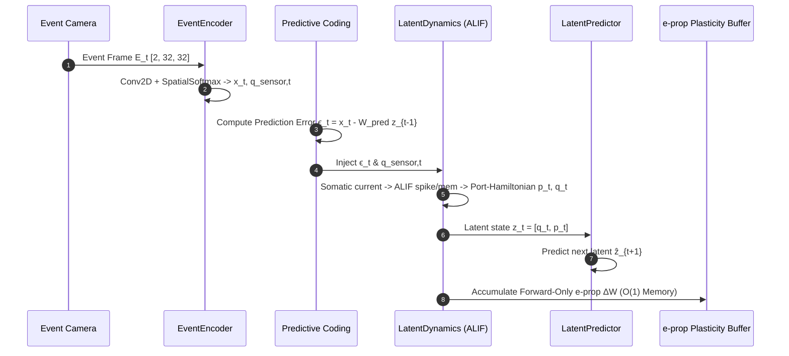

# Architecture Specification: Spiking Predictive World Model (SPWM)

This document provides a comprehensive technical overview of the current architecture, mathematical modeling, neural components, parameters, data pipeline, and training workflows of the **SPWM (Spiking Predictive World Model)** codebase.

---

## 1. System Architecture & Conceptual Diagram

SPWM is a biologically grounded, forward-only spiking recurrent world model designed to process continuous spatio-temporal event streams, maintain multi-timescale internal dynamics, and perform autonomous multi-step rollouts with $\mathcal{O}(1)$ computational memory complexity (zero Backpropagation Through Time across sequence unrolling).

```
                      ┌──────────────────────────────────────┐
                      │  2D Continuous Dynamical World       │
                      │  (Ball Kinematics: pos, vel, bounce) │
                      └──────────────────┬───────────────────┘
                                         │ Continuous coordinates
                                         ▼
                      ┌──────────────────────────────────────┐
                      │  Event Camera Simulator              │
                      │  (|ΔL| > θ_event -> ON/OFF Polarities│
                      └──────────────────┬───────────────────┘
                                         │ Event Stream: [B, T, 2, 32, 32]
                                         ▼
                      ┌──────────────────────────────────────┐
                      │  Topological SpatialSoftmax Encoder   │
                      │  Conv2D -> Spatial Softmax (16 kp)   │
                      └───────┬──────────────────────┬───────┘
                              │                      │
                   x_t [128]  │                      │ Keypoints: q_sensor ∈ [-1, 1]^32
                              ▼                      │ (Supervised via L_coord)
               Predictive Error Coding               │
               ┌───────────────────────┐             │
               │  ϵ_t = x_t - W_pred z │             │
               └──────────┬────────────┘             │
                          │                          │
                          ▼                          │
        ┌────────────────────────────────────────────┴───────────────────────────┐
        │  Recurrent Spiking Latent Dynamics (Phase Space z = [q, p] ∈ R^128)   │
        │                                                                        │
        │   Generalized Coordinates q ∈ R^32:                                    │
        │     • Observation mode: q_t = q_sensor,t                               │
        │     • Autonomous mode:  q_{t+1} = clamp(q_t + tanh(W_vel · s̄_p), -1, 1)│
        │                                                                        │
        │   Momentum State p ∈ R^96 (ALIF Population):                           │
        │     • Port-Hamiltonian Recurrence: W_rec = J - R                       │
        │       J = 0.5 * (S - S^T)  [Conservative skew-symmetric flow]         │
        │       R = diag(softplus(r) + ϵ_diss)  [Dissipative damping]           │
        │     • Dual Timescale Memory:                                           │
        │       - Reactive pool (48 units): β_mem = 0.80, β_adapt = 0.90         │
        │       - Deep context pool (48 units): β_mem = 0.80, β_adapt = 0.985   │
        │     • Intrinsic Homeostatic Adaptive Threshold:                        │
        │       V_th,t = V_th0 + γ · b_t  (γ = 0.18, V_th0 = 1.0)               │
        │       b_t = β_adapt · b_{t-1} + (1 - β_adapt) · s_{t-1}                │
        └───────────────────────────────────┬────────────────────────────────────┘
                                            │
                                  z_t = [q_t, p_t] ∈ R^128
                                            │
                      ┌─────────────────────┴─────────────────────┐
                      ▼                                           ▼
        ┌───────────────────────────┐               ┌───────────────────────────┐
        │     Latent Predictor      │               │   Physical Decoder Probe  │
        │  ẑ_{t+1} = z_t + Δz(z_t)  │               │   x, y   = pos_head(q_t)  │
        │  (Residual MLP Block)     │               │   vx, vy = vel_head(p_t)  │
        └───────────────────────────┘               └───────────────────────────┘
```

---

## 2. Neural Models & Mathematical Formulations

### 2.1. Spiking Neuron: Adaptive Leaky Integrate-and-Fire (ALIF)
Implemented in [`spwm/models/neurons.py`](file:///Users/Mattia/Desktop/Studies/Temp/spwm/models/neurons.py).

The core recurrent units are ALIF cells equipped with dynamic homeostatic thresholds:
1. **Membrane Potential Dynamics**:
   $$V_t = \beta_{\text{mem}} V_{t-1} + I_{\text{soma}, t} - V_{\text{th}, 0} \cdot s_{t-1}$$
   - Soft subtractive reset is utilized.
   - $\beta_{\text{mem}} = 0.80$ corresponds to membrane potential decay constant $\exp(-\Delta t / \tau_m)$.

2. **Threshold Adaptation Dynamics**:
   $$b_t = \beta_{\text{adapt}} b_{t-1} + (1 - \beta_{\text{adapt}}) s_{t-1}$$
   $$V_{\text{th}, t} = V_{\text{th}, 0} + \gamma \cdot b_t$$
   - $V_{\text{th}, 0} = 1.0$ (baseline resting threshold).
   - $\gamma = 0.18$ (threshold adaptation coupling gain).

3. **Spike Generation & Surrogate Gradient**:
   $$s_t = \Theta(V_t - V_{\text{th}, t})$$
   During backward passes or eligibility calculations, the Heaviside step $\Theta(\cdot)$ uses an **Arctan surrogate gradient**:
   $$\psi(v) = \frac{\alpha}{2 (1 + (\frac{\pi}{2} \alpha v)^2)}, \quad \text{with } \alpha = 2.0$$

---

### 2.2. Multi-Timescale Spiking Memory Hierarchy
Implemented in [`spwm/models/memory.py`](file:///Users/Mattia/Desktop/Studies/Temp/spwm/models/memory.py).

The 96-dimensional momentum ALIF population is partitioned into two distinct functional timescale pools:
- **Reactive Pool (48 neurons)**: $\beta_{\text{adapt}} = 0.90$ (fast adaptation, reactive to rapid trajectory perturbations).
- **Deep Context Pool (48 neurons)**: $\beta_{\text{adapt}} = 0.985$ (slow adaptation, long-horizon temporal memory).
- Filtered spike trains are maintained via exponential moving average (EMA):
  $$\bar{s}_{p, t} = \beta_{\text{ema}} \bar{s}_{p, t-1} + (1 - \beta_{\text{ema}}) s_{p, t}, \quad \text{with } \beta_{\text{ema}} = 0.90$$

---

### 2.3. Sensory Frontend: Spatial Softmax Keypoint Encoder
Implemented in [`spwm/models/encoder.py`](file:///Users/Mattia/Desktop/Studies/Temp/spwm/models/encoder.py).

Differential event frames $E_t \in \mathbb{R}^{B \times 2 \times 32 \times 32}$ are processed into a compact topological keypoint bottleneck:
1. **Convolutional Feature Extraction**:
   $$\text{Conv2D}(2 \to 16, k=3, s=2) \to \text{GroupNorm} \to \text{SiLU} \to \text{Conv2D}(16 \to 32, k=3, s=2) \to \text{GroupNorm} \to \text{SiLU}$$
2. **Differentiable Spatial Softmax**:
   Converts feature channels into $K=16$ normalized continuous 2D centers of mass:
   $$u_k = \sum_{x, y} \text{Softmax}_{x,y}(F_k / \tau) \cdot x_{\text{grid}}, \quad v_k = \sum_{x, y} \text{Softmax}_{x,y}(F_k / \tau) \cdot y_{\text{grid}}$$
   producing $q_{\text{sensor}, t} \in [-1, 1]^{32}$.
3. **Linear Projection**:
   $$x_t = \text{Linear}(32 \to 128)(q_{\text{sensor}, t})$$

---

### 2.4. Port-Hamiltonian Spiking Latent Dynamics
Implemented in [`spwm/models/latent_dynamics.py`](file:///Users/Mattia/Desktop/Studies/Temp/spwm/models/latent_dynamics.py).

The latent space is structured as a Canonical Phase Space $z_t = [q_t, p_t] \in \mathbb{R}^{128}$ ($q \in \mathbb{R}^{32}$, $p \in \mathbb{R}^{96}$).

1. **Port-Hamiltonian Recurrence**:
   Recurrent connections within the $p$ momentum population are parameterized as:
   $$W_{\text{rec}} = J - R$$
   - **Conservative Skew-Symmetric Matrix**: $J = \frac{1}{2}(S - S^T)$ with $J^T = -J$.
   - **Dissipative Damping Matrix**: $R = \text{diag}(\text{softplus}(r) + \epsilon_{\text{diss}})$, $\epsilon_{\text{diss}} = 10^{-4}$.
   - **Lyapunov Stability**: Guarantees all eigenvalues satisfy $\text{Re}(\lambda(W_{\text{rec}})) \le -\epsilon_{\text{diss}}$, preventing explosive chaotic bifurcations during infinite open-loop rollouts.

2. **Somatic Input Assembly**:
   $$I_{\text{soma}, t} = W_{\text{in}} \epsilon_t + W_{\text{rec\_proj}} (W_{\text{rec}} p_{t-1}) + W_q q_{t-1}$$

3. **Momentum Fusion**:
   $$p_t = \text{LayerNorm}\left(W_{\text{fuse\_spk}} s_{p, t} + W_{\text{fuse\_mem}} \tanh(V_t)\right)$$

4. **Dual-Mode Coordinate Update ($q_t$)**:
   - **Observation Mode (Sensory frame present)**:
     $$q_t = q_{\text{sensor}, t}$$
   - **Autonomous Mode (Sensors off / rollouts)**:
     $$v_t = W_{\text{vel}} \bar{s}_{p, t}, \quad q_{t+1} = \text{clamp}(q_t + \tanh(v_t), -1.0, 1.0)$$

---

### 2.5. Latent Predictor & Physical Decoder Probe
Implemented in [`spwm/models/predictor.py`](file:///Users/Mattia/Desktop/Studies/Temp/spwm/models/predictor.py).

1. **Latent Predictor ($\hat{z}_{t+1}$)**:
   A 2-layer residual MLP with LayerNorm and SiLU activations:
   $$\hat{z}_{t+1} = z_t + \text{MLP}_{128 \to 256 \to 128}(z_t)$$
2. **Physical Decoder Probe**:
   Decoupled linear probes projecting directly from canonical phase components:
   - Position: $\hat{pos}_t = W_{\text{pos}} q_t$
   - Velocity: $\hat{vel}_t = W_{\text{vel\_probe}} \bar{p}_t$

---

## 3. Workflow & Data Flow

### 3.1. Online Single-Step Execution Loop (`step`)


### 3.2. Autonomous Rollout Loop (`predict_future`)
When making multi-step predictions without sensory events:
1. Sensory error is set to zero ($\epsilon_t = \mathbf{0}$).
2. Momentum state $p_t$ evolves autonomously under internal Port-Hamiltonian dynamics $W_{\text{rec}} = J - R$.
3. Coordinates integrate decoded velocity: $q_{t+1} = \text{clamp}(q_t + \tanh(W_{\text{vel}} \bar{s}_p), -1, 1)$.
4. Position is read out directly from $q_{t+1}$.

---

## 4. Learning Algorithms & Plasticity

### 4.1. Forward-Only e-prop Plasticity ($\mathcal{O}(1)$ Memory)
Implemented in [`spwm/learning/eprop.py`](file:///Users/Mattia/Desktop/Studies/Temp/spwm/learning/eprop.py) and [`spwm/models/world_model.py`](file:///Users/Mattia/Desktop/Studies/Temp/spwm/models/world_model.py).

SPWM replaces global BPTT with local forward-only eligibility traces:
1. **Sensory Predictor Update**:
   $$\Delta W_{\text{pred}} = \frac{1}{B \cdot T} \sum_{t=1}^T \epsilon_t \otimes z_{t-1}$$
2. **Latent Feedback & Feedback Alignment**:
   $$L_{\text{lat}} = \epsilon_t W_{\text{pred}} + \lambda_{\text{kin}} (\epsilon_{\text{kin}} B_{\text{kin\_feedback}})$$
   where $B_{\text{kin\_feedback}} \in \mathbb{R}^{4 \times 128}$ is a fixed random orthogonal feedback alignment matrix.
3. **Synaptic Weight Updates**:
   - Input synapses: $\Delta W_{\text{in}} = \frac{1}{B \cdot T} L_{\text{mem}}^T \epsilon_t$
   - Recurrent Port-Hamiltonian parameters: $\Delta S = \frac{1}{2}(\Delta W_{\text{rec}} - \Delta W_{\text{rec}}^T)$, $\Delta r = -\text{diag}(\Delta W_{\text{rec}}) \odot \sigma(r)$
   - Velocity projection: $\Delta W_{\text{vel}} = \frac{1}{B \cdot T} L_q^T \bar{s}_p$

### 4.2. Multi-Objective Composite Loss
Implemented in [`spwm/learning/losses.py`](file:///Users/Mattia/Desktop/Studies/Temp/spwm/learning/losses.py):

$$\mathcal{L}_{\text{total}} = \mathcal{L}_{\text{pred}} + \lambda_{\text{coord}} \mathcal{L}_{\text{coord}} + \lambda_{\text{probe}} \mathcal{L}_{\text{probe}} + \lambda_{\text{var}} \mathcal{L}_{\text{var}}$$

- **$\mathcal{L}_{\text{pred}}$**: Mean squared error between predicted next latent and target latent $\|\hat{z}_{t+1} - z_{t+1}\|_2^2$.
- **$\mathcal{L}_{\text{coord}}$ ($\lambda_{\text{coord}} = 0.15 \to 1.0$)**: Direct MSE loss coupling the SpatialSoftmax keypoint cloud to true 2D object position.
- **$\mathcal{L}_{\text{probe}}$ ($\lambda_{\text{probe}} = 0.5$)**: Kinematic decoder supervised loss on true position and velocity.
- **$\mathcal{L}_{\text{var}}$ ($\lambda_{\text{var}} = 0.05$)**: Anti-collapse VICReg variance hinge loss maintaining $\text{std}(z) \ge 1.0$.

---

## 5. Parameter Reference

| Component | Parameter | Default Value | Description |
|---|---|---|---|
| **Environment** | `height`, `width` | `32, 32` | Resolution of the event sensor |
| | `dt` | `0.05` | Simulation time increment |
| | `event_threshold` | `0.08` | Log-intensity change threshold for spike emission |
| | `num_objects` | `1` | Number of moving kinematic targets |
| **Encoder** | `conv_channels` | `(16, 32)` | Channel depths of 2D convolutional layers |
| | `num_keypoints` | `16` | Spatial Softmax keypoint pairs ($K \times 2 = 32$ coordinates) |
| | `encoder_dim` | `128` | Output embedding dimension $x_t$ |
| **Latent Space** | `latent_dim` | `128` | Total latent state dimension $z = [q, p]$ |
| | `q_dim` | `32` | Generalized spatial coordinate dimension |
| | `p_dim` | `96` | Spiking momentum population dimension |
| | `ema_decay` | `0.90` | Decay rate for filtered spike buffer $\bar{s}_p$ |
| | `epsilon_diss` | `1e-4` | Minimum dissipation floor for Port-Hamiltonian damping $R$ |
| **ALIF Neurons** | `beta_mem` | `0.80` | Sub-threshold membrane voltage retention |
| | `betas_adapt` | `(0.90, 0.985)` | Adaptation decays for fast (48) and slow (48) pools |
| | `v_th0` | `1.0` | Baseline resting firing threshold |
| | `gamma` | `0.18` | Dynamic threshold coupling coefficient |
| | `surrogate` | `"atan"` ($\alpha=2.0$) | Surrogate gradient formulation |
| **Predictor** | `hidden_dim` | `256` | Hidden dimension of residual transition MLP |
| **Optimizer** | `learning_rate` | `2e-4` | Online forward-only learning rate |
| | `local_lr` | `2e-4` | Local e-prop parameter update scale |
| | `probe_lr` | `5e-4` | Dedicated AdamW learning rate for probe decoders |
| | `weight_decay` | `1e-4` | L2 weight regularization |

---

## 6. Directory Structure & Key Files

```
spwm/
├── data/
│   ├── synthetic_world.py      # 2D ball kinematics simulator with boundary bounce
│   ├── event_camera.py         # Neuromorphic intensity differential sensor simulator
│   └── datasets.py             # PyTorch Dataset and caching data loaders
├── models/
│   ├── neurons.py              # LIF and ALIF spiking neuron cells with dynamic thresholds
│   ├── memory.py               # MultiTimescaleMemory multi-tier population container
│   ├── surrogate.py            # Differentiable surrogate gradient functions (Atan, FastSigmoid)
│   ├── encoder.py              # Conv2D + SpatialSoftmax topological keypoint frontend
│   ├── latent_dynamics.py      # Port-Hamiltonian (W_rec = J - R) canonical phase dynamics
│   ├── predictor.py            # Latent transition predictor & physical linear probes
│   └── world_model.py          # Unified SPWM module: step(), forward(), predict_future()
├── learning/
│   ├── eprop.py                # ALIF dual eligibility trace forward-only plasticity engine
│   ├── losses.py               # SPWMLoss (prediction, coordinate, probe, VICReg variance)
│   ├── metrics.py              # Rollout MSE, position error, velocity error, spike rates
│   └── trainer.py              # Online O(1) streaming trainer with curriculum gating
└── configs/
    ├── base.yaml               # Baseline system hyperparameter schema
    └── experiments/            # Experiment-specific configuration presets
```
