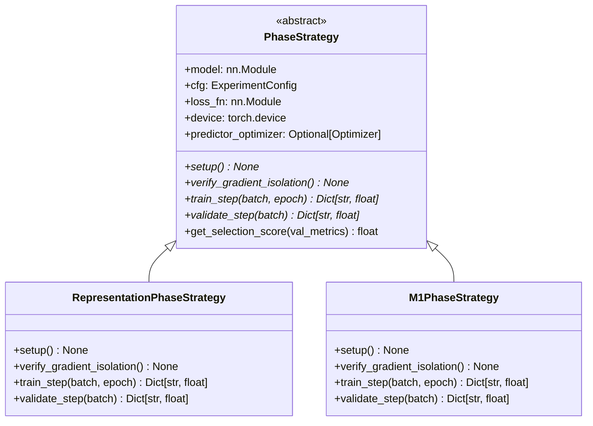

# Loss Formulations, Isolated Phase Strategies & Checkpoint Scoping (`spwm/training/`)

This document details the mathematical formulations, gradient isolation guarantees, and checkpoint scoping rules implemented in Layer 2 ([`spwm/training/`](file:///Users/Mattia/Desktop/Studies/Temp/spwm/training/__init__.py)) for **SPWM-v0.4.0 (Action-Conditioned Attractor Dynamics)**.

---

## 1. Isolated Phase Strategy Architecture (`spwm/training/phases/`)

SPWM-v0.4.0 decouples representation learning from action-conditioned latent predictive dynamics, isolating each phase into a dedicated `< 150`-line strategy class inheriting from [`PhaseStrategy`](file:///Users/Mattia/Desktop/Studies/Temp/spwm/contracts/protocols.py):

```mermaid
classDiagram
    class PhaseStrategy {
        <<abstract>>
        +model: nn.Module
        +cfg: ExperimentConfig
        +loss_fn: nn.Module
        +device: torch.device
        +predictor_optimizer: Optional[Optimizer]
        +setup()* None
        +verify_gradient_isolation()* None
        +train_step(batch, epoch)* Dict[str, float]
        +validate_step(batch)* Dict[str, float]
        +get_selection_score(val_metrics) float
    }

    class RepresentationPhaseStrategy {
        +setup() None
        +verify_gradient_isolation() None
        +train_step(batch, epoch) Dict[str, float]
        +validate_step(batch) Dict[str, float]
    }

    class M1PhaseStrategy {
        +setup() None
        +verify_gradient_isolation() None
        +train_step(batch, epoch) Dict[str, float]
        +validate_step(batch) Dict[str, float]
    }

    PhaseStrategy <|-- RepresentationPhaseStrategy
    PhaseStrategy <|-- M1PhaseStrategy
```

---

## 2. Granular Breakdown of Training Strategies

### 2.0 Phase 0: `RepresentationPhaseStrategy` ([`spwm/training/phases/representation.py`](file:///Users/Mattia/Desktop/Studies/Temp/spwm/training/phases/representation.py))
- **Purpose**: Train the Spiking Network to act as a grounded, continuous state estimator on sensory input streams $t \in [0, T_{\text{obs}}]$. Zero autoregressive mental rollouts are permitted in this phase.
- **Parameter Mask**:
  - **Active (`requires_grad=True`)**: `model.encoder`, `model.dynamics` (`SpikingLatentDynamics`), `model.sensory_predictor`, `model.physical_decoder`.
  - **Frozen / Inactive (`requires_grad=False`)**: `model.predictor` (`model.m1`) (must not receive gradients or participate in the forward pass of Phase 0).
- **Optimizer Groups**:
  - `model.encoder`, `model.dynamics`, `model.sensory_predictor`: `lr = cfg.training.learning_rate`, `weight_decay = cfg.training.weight_decay`.
  - `model.physical_decoder`: `lr = cfg.training.probe_lr`, `weight_decay = cfg.training.probe_weight_decay`.
- **Forward Pass**:
  Executes `model.forward_representation(events)` over $t \in [0, T_{\text{obs}}]$ computing $\mathbf{z}_t = (\mathbf{q}_t, \mathbf{p}_t)$ directly from sensory input streams.
- **Strict Loss Constraints**:
  1. **$\mathcal{L}_{\text{kinematic}}$**: Supervised loss decoding articulated joint angles $\mathbf{q}^*$ and angular velocities $\mathbf{p}^*$:
     $$\mathcal{L}_{\text{kinematic}} = \text{MSE}(\text{decode\_pos}(\mathbf{q}_t), \mathbf{q}_t^*) + \text{MSE}(\text{decode\_vel}(\mathbf{p}_t), \mathbf{p}_t^*)$$
  2. **$\mathcal{L}_{\text{derivative}}$**: Strict phase-space factorization constraint:
     $$\mathcal{L}_{\text{derivative}} = \text{MSE}((\mathbf{q}_{t+1} - \mathbf{q}_t), dt \cdot \mathbf{p}_t)$$
  3. **$\mathcal{L}_{\text{smoothness}}$**: High-frequency noise suppression on ALIF outputs:
     $$\mathcal{L}_{\text{smoothness}} = \text{MSE}(\mathbf{p}_{t+1}, \mathbf{p}_t)$$
  4. **$\mathcal{L}_{\text{sensory}}$**: Top-down sensory reconstruction loss from `sensory_predictor`:
     $$\mathcal{L}_{\text{sensory}} = \text{MSE}(\boldsymbol{\epsilon}_t, \mathbf{0})$$
  $$\mathcal{L}_{\text{Phase 0}} = \lambda_{\text{kinematic}} \mathcal{L}_{\text{kinematic}} + \lambda_{\text{derivative}} \mathcal{L}_{\text{derivative}} + \lambda_{\text{smoothness}} \mathcal{L}_{\text{smoothness}} + \lambda_{\text{sensory}} \mathcal{L}_{\text{sensory}}$$

### 2.1 Phase 1: `M1PhaseStrategy` ([`spwm/training/phases/m1_nominal.py`](file:///Users/Mattia/Desktop/Studies/Temp/spwm/training/phases/m1_nominal.py))
- **Purpose**: Train the Action-Conditioned Latent Attractor Predictor ($M_1$) strictly on pristine phase-space vectors generated by the frozen representation, conditioned on applied continuous motor action vectors $\mathbf{u}_{0:H}$.
- **State Pre-condition**:
  - `encoder`, `dynamics`, `sensory_predictor`, and `physical_decoder` **MUST BE FROZEN** (`requires_grad = False`).
  - Optimizer updates **only `model.predictor`** (`model.m1`).
- **Forward Pass**:
  1. Generates ground-truth latent trajectory $\mathbf{z}_{0:T}^*$ using frozen Phase 0 modules (`model.forward_representation`).
  2. Detaches $\mathbf{z}^*$: $\mathbf{z}_{\text{target}} = \text{stop\_grad}(\mathbf{z}^*)$.
  3. Extracts action slice $\mathbf{u}_{0:H}$ from batch (or zero action defaults).
  4. Runs $M_1$ autoregressively across horizon $H$:
     $$\hat{\mathbf{z}}_{t+1} = M_1(\hat{\mathbf{z}}_t, \mathbf{u}_t)$$
- **Loss Constraint**:
  $$\mathcal{L}_{M_1} = \text{MSE}(\hat{\mathbf{z}}_{t+1}, \mathbf{z}_{\text{target}, t+1})$$
  No kinematic or sensory backpropagation occurs in Phase 1; $M_1$ trains purely in latent phase space to reproduce the driven attractor vector field.

---

## 3. Action-Conditioned Attractor Vector Field Learning

When continuous robotic systems operate in real physical worlds, interactions with ground contact friction, gravity, and motor torques create dissipative vector fields and limit-cycle attractors.

In [`LatentPredictor`](file:///Users/Mattia/Desktop/Studies/Temp/spwm/models/predictors.py):
1. State $\mathbf{z}_t$ is concatenated with continuous action $\mathbf{u}_t \in \mathbb{R}^{D_u}$:
   $$\mathbf{h}_t = \text{Backbone}([\mathbf{z}_t, \mathbf{u}_t])$$
2. The network decomposes the update into state-dependent dissipation $\gamma_t = \sigma(\text{Head}_{\text{diss}}(\mathbf{h}_t))$, momentum force head $\mathbf{f}_p = \text{Head}_p(\mathbf{h}_t)$, and coordinate velocity head $\mathbf{f}_q = \text{Head}_q(\mathbf{h}_t)$:
   $$\mathbf{p}_{t+1} = (1 - \Delta t \cdot \gamma_t) \mathbf{p}_t + \mathbf{f}_p$$
   $$\mathbf{q}_{t+1} = \mathbf{q}_t + \Delta t \cdot (\mathbf{p}_{t+1}[..., :q\_dim] + \mathbf{f}_q)$$
   $$\hat{\mathbf{z}}_{t+1} = [\mathbf{q}_{t+1}, \mathbf{p}_{t+1}]$$

This construction enables the model to natively stabilize around CPG walking limit cycles and fixed-point posture equilibria without requiring artificial manifold denoisers or external projection steps.

---

## 4. Scoped `strict=True` Checkpoint Protocol

To prevent silent weight corruption or partial state-dict mismatches across phases, [`spwm/training/engine.py`](file:///Users/Mattia/Desktop/Studies/Temp/spwm/training/engine.py) provides dedicated scoped loaders:

| Function | Source Checkpoint | Target Sub-Modules Loaded (`strict=True`) | Untouched Modules |
| :--- | :--- | :--- | :--- |
| [`load_representation_checkpoint(model, path)`](file:///Users/Mattia/Desktop/Studies/Temp/spwm/training/engine.py) | Phase 0 (`train_representation`) `model.pt` | `model.encoder`, `model.dynamics`, `model.sensory_predictor`, `model.physical_decoder` | `model.predictor` |
| [`BaseTrainer.load_checkpoint(path)`](file:///Users/Mattia/Desktop/Studies/Temp/spwm/training/engine.py) | Full `SPWM` `checkpoint.pt` / `model.pt` | Full `model` (`model.load_state_dict(..., strict=True)`) + optimizer state | None |
| [`enforce_phase_prerequisites(model, cfg, ...)`](file:///Users/Mattia/Desktop/Studies/Temp/spwm/training/engine.py) | Prerequisite checkpoints auto-resolved by version | Loads Phase 0 for Phase 1 (`train_m1`) | Unrelated phase modules |
