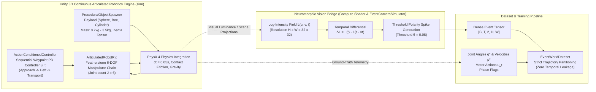

# Simulation Environment & Event Camera Specification (`WORLD.md`)

This document provides the authoritative mathematical and computational specification of the simulation environment and dual-camera neuromorphic sensor pipeline utilized to train and benchmark **SPWM-v0.6.0 (Dual-Camera 6-DOF Active Perception Grasping & Spiking Predictive World Model for 3D Articulated Manipulation)**.

All code implementations reside in Layer 1 of the architecture ([`spwm/data/`](file:///Users/Mattia/Desktop/Studies/Temp/spwm/data/__init__.py)) and Unity C# physics assets ([`sim/Assets/Scripts/`](file:///Users/Mattia/Desktop/Studies/Temp/sim/Assets/Scripts/ArticulatedRobotRig.cs)), governed strictly by Layer 0 contracts ([`spwm/contracts/config.py`](file:///Users/Mattia/Desktop/Studies/Temp/spwm/contracts/config.py)).

---

## 1. Overview & 3D Unity Robotics Environment

The simulation environment provides a **PhysX 4 Featherstone ArticulationBody continuous 3D robotics simulation** implemented in Unity C# with Python streaming interop. The system models a 6-DOF articulated robotic manipulator arm driven by continuous motor action vectors $\mathbf{u}_t \in \mathbb{R}^{D_u}$ ($D_u = J = 6$), manipulating procedurally spawned rigid payloads of varying shape and mass, observed by a differential neuromorphic vision sensor ([`EventCameraSimulator`](file:///Users/Mattia/Desktop/Studies/Temp/spwm/data/event_camera.py) / [`NeuromorphicEventBridge`](file:///Users/Mattia/Desktop/Studies/Temp/sim/Assets/Scripts/NeuromorphicEventBridge.cs)).

```mermaid
flowchart LR
    subgraph Unity["Unity 3D Continuous Articulated Robotics Engine (sim/)"]
        Rig["ArticulatedRobotRig\nFeatherstone 6-DOF Manipulator Chain\n(Joint count J = 6)"]
        Spawner["ProceduralObjectSpawner\nPayload (Sphere, Box, Cylinder)\nMass: 0.2kg - 3.5kg, Inertia Tensor"]
        Ctrl["ActionConditionedController\nSequential Waypoint PD Controller u_t\n(Approach -> Heft -> Transport)"]
        Phys["PhysX 4 Physics Integration\ndt = 0.05s, Contact Friction, Gravity"]
        Spawner --> Phys
        Ctrl --> Rig
        Rig --> Phys
        Phys --> Rig
    end

    subgraph Sensor["Neuromorphic Vision Bridge (Compute Shader & EventCameraSimulator)"]
        Phys -.->|"Visual Luminance / Scene Projections"| Render["Log-Intensity Field L(u, v; t)\n(Resolution H x W = 32 x 32)"]
        Render --> Diff["Temporal Differential\nΔL = L(t) - L(t - Δt)"]
        Diff --> Spikes["Threshold Polarity Spike Generation\n(Threshold θ = 0.08)"]
    end

    subgraph Output["Dataset & Training Pipeline"]
        Spikes --> Dense["Dense Event Tensor\n[B, T, 2, H, W]"]
        Phys -.->|"Ground-Truth Telemetry"| Kin["Joint Angles q* & Velocities p*\nMotor Actions u_t\nPhase Flags"]
        Dense & Kin --> Dataset["EventWorldDataset\nStrict Trajectory Partitioning\n(Zero Temporal Leakage)"]
    end
```

### 1.1 Robotic Kinematic Morphology & Archetype

The core robotic rig ([`ArticulatedRobotRig`](file:///Users/Mattia/Desktop/Studies/Temp/sim/Assets/Scripts/ArticulatedRobotRig.cs)) and its playback replica ([`KinematicRobotRig`](file:///Users/Mattia/Desktop/Studies/Temp/sim/Assets/Scripts/Visualization/GhostPlaybackManager.cs)) are configured as an **Anthropomorphic 6-DOF Right Humanoid Arm (`RobotArchetype.ManipulatorArm`, $J=6$ actuated revolute joints, `MaxJointAngleRad = 3.14` rad)**:
- **Root Socket (`Base_Root`)**: Immovable shoulder socket mounted at `ShoulderMountHeight = 1.25m` (`BaseHeight = 0.05m`, $20.0\,\text{kg}$) with zero vertical industrial support column beneath the shoulder.
- **Joint 0 (`Shoulder_Pan`)**: Compact shoulder pan / internal-external yaw socket (`TurretHeight = 0.05m`, $2.5\,\text{kg}$, limits $[-120^\circ, 120^\circ]$), placing the glenohumeral joint at human shoulder height (`ShoulderElevation = 1.35m`).
- **Joint 1 (`Shoulder_Lift`)**: Human upper arm / humerus (`UpperArmLength = 0.28m`, $2.2\,\text{kg}$, limits $[-90^\circ, 185^\circ]$), enabling the upper arm to hang naturally downward from the right shoulder (`q1 ≈ 2.92 rad` / $167^\circ$ from $+Y$ in resting pose).
- **Joint 2 (`Elbow_Flex`)**: Human forearm / radius-ulna (`ForearmLength = 0.25m`, $1.6\,\text{kg}$, limits $[-155^\circ, 15^\circ]$, medial carrying/swivel axis `AxisRotationEuler = (0°, 56°, -16°)`), operating in an anatomical human posture ($q_2 \le 0$) where the elbow starts closed/flexed down at the right side and opens/extends diagonally toward the left target as the elbow raises and turns right.
- **Joint 3 (`Wrist_Pitch`)**: Proximal carpal flexion/extension (`WristPitchLength = 0.04m`, $0.6\,\text{kg}$, limits $[-95^\circ, 95^\circ]$, `AxisRotationEuler = (0°, 56°, -16°)`). Serves as the base anchor for the unified anatomical wrist cuff sleeve (spanning the full $0.14\,\text{m}$ transition to the hand).
- **Joint 4 (`Wrist_Yaw`)**: Distal carpal radial/ulnar deviation (`WristYawLength = 0.04m`, $0.5\,\text{kg}$, limits $[-75^\circ, 75^\circ]$). Kinematic anchor unified visually within the wrist cuff sleeve.
- **Joint 5 (`Wrist_Roll`)**: Forearm/hand pronation-supination (`WristRollLength = 0.06m`, $0.5\,\text{kg}$, limits $[-180^\circ, 180^\circ]$ so the palm can rotate from facing down (270°) at grasp to open up-left (135°) at the end, solved in closed form by `SolveInverseKinematicsOrientedStatic` (palm normal = tip local +Z; `Wrist_Pitch`/`Wrist_Yaw` held at 0, orientation achieved by roll only); `TotalWristToolLength = 0.14m`), visually rendered as a compact terminal wrist band and terminating in an anatomical **right humanoid hand** (`HumanoidPalm`, `HumanoidKnuckles`, 4 two-segment articulated fingers `HumanoidFingerProx_*` / `HumanoidFingerDist_*`, and a medial/radial right-hand thumb `WristOrientationFiducial` / `HumanoidThumbDistal` on $-X$). The previous visual appearance of multiple segmented wrist slices and redundant joint sphere clusters has been consolidated into a continuous anatomical forearm-to-wrist sleeve across both [`ArticulatedRobotRig`](file:///Users/Mattia/Desktop/Studies/Temp/sim/Assets/Scripts/ArticulatedRobotRig.cs) and [`GhostPlaybackManager`](file:///Users/Mattia/Desktop/Studies/Temp/sim/Assets/Scripts/Visualization/GhostPlaybackManager.cs).
- **Anthropomorphic Head Camera Perspective ([`CinematicCameraTracker`](file:///Users/Mattia/Desktop/Studies/Temp/sim/Assets/Scripts/Visualization/CinematicCameraTracker.cs) & [`SensoryStreamDisplay`](file:///Users/Mattia/Desktop/Studies/Temp/sim/Assets/Scripts/Visualization/SensoryStreamDisplay.cs))**:
  - Positioned at human eye-level head perspective relative to the right shoulder (`HeadOffsetFromShoulder = (-0.22m, +0.25m, -0.28m)`, world position `(-0.22m, 1.60m, -0.28m)`), tilted downward toward the left-side manipulation workspace (`EyeCameraLookTargetOffset = (-0.12m, 1.06m, 0.44m)`), bringing the complete shoulder cap, humerus, elbow hinge, forearm, wrist, hand, and left target into clear visual framing.
  - **Diagonal Opening Reach Biomechanics**: Target objects are spawned on the left (`startPos.x ≈ -0.185m`, reachable forward reach `z ∈ [0.45m, 0.49m]`). Starting from a closed resting posture (`q_neutral = [1.42, 3.00, -1.78, 0.05, -0.70, -0.25]` rad, elbow down at `y = 1.07m` flexed at `-102°`, hand on the right at `x = +0.02m`), reaching toward the left target causes the shoulder to open slightly right (`q1: 3.00 -> 2.41 rad`), the elbow to raise and turn right (`y: 1.07m -> 1.14m`, `x: +0.04m -> +0.09m -> +0.06m`), the forearm to open and extend (`q2: -1.78 -> -0.95 rad`, opening from `102°` to `54°`), and the hand to follow a diagonal trajectory from the lower-right (`x = +0.02m`) to grasp and lift the payload on the left (`x = -0.18m`), maintaining natural inward wrist supination (negative `Wrist_Roll` in `[-1.45, 0.10]` rad, physical limits `[-95°, 15°]`).
- **Physical Quantities**:
  - Global joint friction: $\mu_{\text{joint}} = 0.06\,\text{N}\cdot\text{s}$
  - Angular damping: $0.25\,\text{s}^{-1}$
  - Ground static/dynamic friction: $\mu_s = 0.90, \mu_k = 0.80$
  - Gravity: $\mathbf{g} = [0, -9.81, 0]^T\,\text{m/s}^2$

---

## 2. Action Conditioning & Active Perception Grasping ([`ActionConditionedController`](file:///Users/Mattia/Desktop/Studies/Temp/sim/Assets/Scripts/ActionConditionedController.cs))

### 2.1 State Representation & Motor Actions

At discrete time index $t \in \{0, 1, \dots, T-1\}$ with physics step $\Delta t = \text{dt} = 0.05\,\text{s}$:
- **Joint Positions (Generalized Coordinates)**: $\mathbf{q}_t^* \in [-1.0, 1.0]^J$ ($J=6$)
- **Joint Angular Velocities (Generalized Momenta)**: $\mathbf{p}_t^* \in \mathbb{R}^J$ ($J=6$)
- **Applied Motor Action Vector**: $\mathbf{u}_t \in [-1.0, 1.0]^{D_u}$ ($D_u = \text{action\_dim} = 6$)
- **Execution Phase Flags** (`phase_flag`): Discrete tag identifying sensory-motor regime:
  - `0 = BlindApproach`: Neutral setup followed by smooth minimum-jerk trajectory toward grasp coordinates.
  - `1 = SensoryHeft`: Activated $N$ steps prior to contact (`pre_contact_sensory_steps = 7`) for sensory grounding, ramping to 100% injection 3-4 steps ahead, followed by collision-triggered rigid attachment, held for `post_contact_sensory_steps = 3` post-contact, and upward micro-movement (+12 cm lift with wrist twist, no acceleration/gain boost) generating informative event transients and velocity responses proportional to payload mass and inertia.
  - `2 = BlindTransport`: Smooth trajectory interpolation to the 6D target pose with wrist orientation variations to stress rotational inertia predictions.

### 2.2 Procedural Object Spawner & Rigid Grasp Attachment

[`ProceduralObjectSpawner`](file:///Users/Mattia/Desktop/Studies/Temp/sim/Assets/Scripts/ProceduralObjectSpawner.cs) instantiates physical payloads in front of the torso/head across three anthropomorphic workspace elevation planes:
- **Elevation Planes**: `Low` ($1.04\,\text{m}$, tabletop level below shoulder), `Mid` ($1.14\,\text{m}$, natural manipulation level), and `High` ($1.26\,\text{m}$, upper chest/reach level) at forward reach distances $[0.42, 0.52]\,\text{m}$.
- **Primitive Shapes**: Sphere, Elongated Cylinder, Box.
- **Mass Distribution**: Randomly sampled mass in $[1.20, 4.50]\,\text{kg}$ creating substantial variance in gravitational torques and inertial resistance.
- **Attachment**: A `FixedJoint` constraint attaches the object into the humanoid right palm and curved fingers upon contact, eliminating finger slip friction and directly transferring the payload's mass and inertia tensor into the Featherstone kinematic chain.

### 2.3 Numerical Physics Integration

Dynamics follow second-order dissipative equations integrated via PhysX 4 Featherstone solver (or Python reference kinematics simulation [`simulate_articulated_trajectory`](file:///Users/Mattia/Desktop/Studies/Temp/spwm/data/datasets.py)):
$$\mathbf{p}_{t+1} = \mathbf{p}_t + \Delta t \left[ K_{\text{stiff}}(\mathbf{u}_t - \mathbf{q}_t) - \mathbf{\tau}_{\text{gravity}}(\mathbf{q}_t, m_{\text{payload}}) - \mu_c \tanh(5 \mathbf{p}_t) - \gamma \mathbf{p}_t \right]$$
$$\mathbf{q}_{t+1} = \text{clip}\left(\mathbf{q}_t + \Delta t \cdot \mathbf{p}_{t+1}, -1.0, 1.0\right)$$
where $\gamma = \text{viscous\_damping} = 0.25$, $K_{\text{stiff}} = 6.5$.

---

## 3. Neuromorphic Event Camera Sensor ([`EventCameraSimulator`](file:///Users/Mattia/Desktop/Studies/Temp/spwm/data/event_camera.py) & `NeuromorphicEventBridge`)

The neuromorphic visual pipeline captures dynamic scene motion without emitting synchronous frame matrices.

### 3.1 Dual Pipeline Execution: GPU Compute Shader & Continuous Projection

1. **Unity GPU Compute Shader ([`EventCameraLogDiff.compute`](file:///Users/Mattia/Desktop/Studies/Temp/sim/Assets/Shaders/EventCameraLogDiff.compute))**:
   - Renders high-speed camera frames into a `RenderTexture`.
   - Computes logarithmic luminance $L(u, v; t) = \ln(\text{luminance}(I(u, v; t)) + \epsilon)$.
   - Emits asynchronous ON/OFF polarity spikes into a structured compute buffer at native physics FPS.
2. **Layer 1 Python Simulator ([`EventCameraSimulator`](file:///Users/Mattia/Desktop/Studies/Temp/spwm/data/event_camera.py))**:
   - Supports direct ingestion of Unity pre-rendered event tensors or high-FPS grayscale luminance sequences.
   - For standalone testing and synthetic benchmarking, generates forward-kinematic projected articulated link intensities across normalized coordinates $(u, v) \in [-1, 1]^2$.

### 3.2 Temporal Contrast Accumulation & Event Generation

Rather than naive frame-to-frame subtraction (which causes event dropout during slow articulated motions), [`EventCameraSimulator`](file:///Users/Mattia/Desktop/Studies/Temp/spwm/data/event_camera.py) implements **temporal contrast accumulation** with a persistent reference intensity state $I_{\text{ref}}(u, v)$:
$$\Delta L(u, v; t) = I(u, v; t) - I_{\text{ref}}(u, v; t)$$
$$S_{\text{pos}}(u, v; t) = \mathbb{I}\left( \Delta L(u, v; t) > \theta \right) \quad (\text{Channel 0: Brightening})$$
$$S_{\text{neg}}(u, v; t) = \mathbb{I}\left( \Delta L(u, v; t) < -\theta \right) \quad (\text{Channel 1: Dimming})$$

When either polarity condition is triggered, the reference intensity is updated exclusively for the spiking pixel:
$$I_{\text{ref}}(u, v; t + 1) = \begin{cases} I(u, v; t) & \text{if } S_{\text{pos}}(u, v; t) \lor S_{\text{neg}}(u, v; t) \\ I_{\text{ref}}(u, v; t) & \text{otherwise} \end{cases}$$
Default threshold $\theta = \text{event\_threshold} = 0.08$.

### 3.3 Event Stream Formats

- **Dense Event Tensor** (`dense_events`): $\mathbf{E} \in \{0, 1\}^{B \times T \times 4 \times H \times W}$ ($C=4$: channels `0..1` static global ON/OFF, channels `2..3` egocentric wrist-mounted ON/OFF; $H=W=32$ by default).
- **Sparse Event List** (`sparse_events`): Tuples of $(t, c, y, x)$ for neuromorphic backends.

---

## 4. Dataset Partitioning & Zero Temporal Leakage ([`spwm/data/datasets.py`](file:///Users/Mattia/Desktop/Studies/Temp/spwm/data/datasets.py))

### 4.1 Strict Trajectory-Level Partitioning

To strictly prevent temporal leakage, partitioning is performed strictly at the **trajectory index** level via [`partition_trajectories`](file:///Users/Mattia/Desktop/Studies/Temp/spwm/data/datasets.py), supporting gzip-compressed Unity logs (`trajectory_*.json.gz`), uncompressed JSON (`trajectory_*.json`), and pre-rendered NPZ (`trajectory_*.npz`):

| Split | Trajectory ID Range | Default Fraction | Trajectory Count (out of 4,000) | Dynamics Regime |
| :--- | :--- | :--- | :--- | :--- |
| **Train** | $[0, N_{\text{train}})$ | $80\%$ | 3,200 trajectories | Standard joint velocities $[-1.0, 1.0]$, randomized payloads and grasping paths |
| **Validation** | $[N_{\text{train}}, N_{\text{train}} + N_{\text{val}})$ | $10\%$ | 400 trajectories | Standard joint velocities $[-1.0, 1.0]$, unseen payload/target configurations |
| **Test** | $[N_{\text{train}} + N_{\text{val}}, N_{\text{total}})$ | $10\%$ | 400 trajectories | Standard joint velocities $[-1.0, 1.0]$, unseen payload/target configurations |
| **Extrapolation** | $[N_{\text{total}}, N_{\text{total}} + 100)$ | Held-out | 100 trajectories | Higher velocity bounds $[-2.0, 2.0]$ for out-of-distribution dynamic stress testing |

### 4.2 Determinism & Reproducibility

Every trajectory $k$ is deterministically generated or replayed from exported Unity logs using `np.random.default_rng(seed=k)` or Unity `trajectory_id` initialization, ensuring exact bitwise consistency.

---

## 5. Configuration Contract Parameters (`EnvironmentConfig` & `DataConfig`)

Defined in [`spwm/contracts/config.py`](file:///Users/Mattia/Desktop/Studies/Temp/spwm/contracts/config.py):

### 5.1 [`EnvironmentConfig`](file:///Users/Mattia/Desktop/Studies/Temp/spwm/contracts/config.py#L68-L90)

| Parameter | Type | Default | Description | Invariants / Constraints |
| :--- | :--- | :--- | :--- | :--- |
| `joint_count` | `int` | `6` | Number of articulated joints $J$ in the 6-DOF manipulator arm | Must equal $J=6$ |
| `action_dim` | `int` | `6` | Dimensionality $D_u$ of continuous motor action vectors $\mathbf{u}_t$ | Must equal $D_u=6$ |
| `height` | `int` | `32` | Sensor pixel height | Must be $> 0$ and divisible by 4 |
| `width` | `int` | `32` | Sensor pixel width | Must be $> 0$ and divisible by 4 |
| `dt` | `float` | `0.05` | Simulation timestep duration (seconds) | $\Delta t = 50\,\text{ms}$ per discrete step |
| `event_threshold`| `float` | `0.08` | Log-intensity change threshold $\theta$ | Positive float |

### 5.2 [`DataConfig`](file:///Users/Mattia/Desktop/Studies/Temp/spwm/contracts/config.py#L93-L128)

| Parameter | Type | Default | Description |
| :--- | :--- | :--- | :--- |
| `dataset_dir` | `str` | `"sim/ExportedTrajectories"` | Path to exported Unity robotic trajectory JSON / JSON.GZ files |
| `joint_count` | `int` | `6` | Articulated joint count expected in dataset trajectories ($J=6$) |
| `action_dim` | `int` | `6` | Motor action vector dimensionality ($D_u=6$) |
| `total_trajectories` | `int` | `4000` | Total number of trajectories generated across all splits |
| `train_split` | `float` | `0.8` | Fraction of dataset allocated to training ($\text{train} + \text{val} < 1.0$) |
| `val_split` | `float` | `0.1` | Fraction of dataset allocated to validation |
| `sequence_length` | `int` | `105` | Number of timesteps per trajectory ($T$) |
| `batch_size` | `int` | `32` | Batch size $B$ for PyTorch DataLoaders |
| `standard_velocity_range` | `(float, float)`| `(-1.0, 1.0)` | Joint angular velocity scaling range for standard trajectories |
| `extrapolation_velocity_range` | `(float, float)`| `(-2.0, 2.0)` | Velocity range for out-of-distribution stress testing |
| `cache_data` | `bool` | `True` | Whether to pre-render and cache event tensors in memory |
| `strict_dataset` | `bool` | `True` | Whether to strictly require real exported Unity trajectories (fail if missing) |
| `pre_contact_sensory_steps` | `int` | `7` | Number of approach steps before physical contact where Phase 1.5 sensory grounding begins |
| `post_contact_sensory_steps` | `int` | `3` | Number of steps after contact where sensory grounding injection is maintained before release |

---

## 6. Batch Collation & Contract Shapes

Each item returned by [`EventWorldDataset`](file:///Users/Mattia/Desktop/Studies/Temp/spwm/data/datasets.py) and batched by `collate_event_batches` adheres to the following contract shapes:

| Key | Tensor Shape | Dtype | Semantic Meaning |
| :--- | :--- | :--- | :--- |
| `"events"` | `[B, T, 4, H, W]` | `torch.float32` | Dual-camera sparse binary event frames (Ch 0..1: Global $+$/$-$, Ch 2..3: Egocentric Wrist $+$/$-$) |
| `"positions"` | `[B, T, joint_count]` | `torch.float32` | Ground-truth joint angles $\mathbf{q}^*$ ($J=6$) in radians / normalized |
| `"velocities"` | `[B, T, joint_count]` | `torch.float32` | Ground-truth joint angular velocities $\mathbf{p}^*$ ($J=6$) |
| `"actions"` | `[B, T, action_dim]` | `torch.float32` | Motor action commands $\mathbf{u}_t$ ($D_u=6$) |
| `"phase_flags"` | `[B, T]` | `torch.int64` | Phasic trajectory tag in $\{0, 1, 2\}$ |
| `"flat_kinematics"` | `[B, T, 2 * joint_count]` | `torch.float32` | Concatenated $[\mathbf{q}^*, \mathbf{p}^*]$ vectors ($2J=12$) |
| `"trajectory_ids"` | `[B]` | `torch.int64` | Globally unique trajectory index |

These kinematic tensors serve as ground-truth supervision targets for representation learning ([`RepresentationPhaseStrategy`](file:///Users/Mattia/Desktop/Studies/Temp/spwm/training/phases/representation.py)), joint angle/velocity probing, and action-conditioned multi-horizon physical rollout evaluation ([`RolloutEvaluator`](file:///Users/Mattia/Desktop/Studies/Temp/spwm/evaluation/evaluator.py)).

